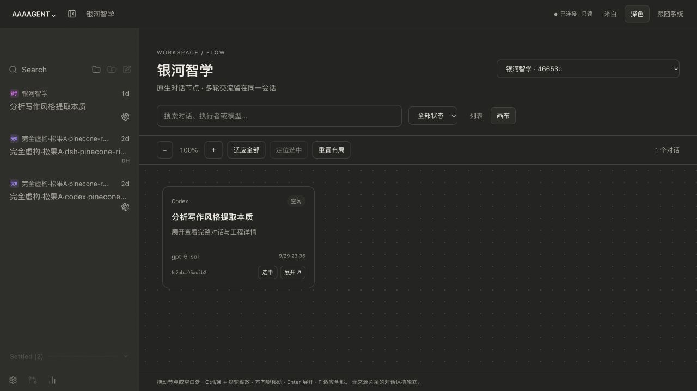

# V2.0 延期说明

2026 年 10 月 3 日

抱歉，让大家久等了。十一玩得太开心，加上工程适配还没调顺，**T3 工作台整合、可视化 Agent Flow 节点矩阵、本地模型接入、优化后的记忆管理，以及承诺的 DeepSeek 大鲸鱼 Live2D**，都要延后一段时间发布。

我想把安装、接入和实际使用都调好，交付一套完善、真正能用的版本，让大家少在本地反复改配置、修问题。

工程上，接入的 T3 版本缺少现成的 DeepSeek Harness／国产模型通道，原先的 Codex 连接也绑定了旧版本。我正在补齐通道适配、升级兼容和会话同步。

鲸鱼 Live2D 的动作和立体视角比预期难做。AI 生成动作素材时，容易出现视角错位和形体不一致，需要我手工调整，还要花些时间。作为替代，已经准备了一只桌宠和多套表情，会随 **V2.0** 一起更新。

## 开发中的 Flow 工作台

以对话节点组织项目，点击节点展开会话。上图为开发预览；工作台基于 [T3 Code](https://github.com/pingdotgg/t3code) 整合。

## English

### V2.0 release delay

October 3, 2026

Sorry for keeping you waiting. I enjoyed the National Day holiday a little too much, and engineering integration still needs work. **T3 workbench integration, the visual Agent Flow node matrix, local model support, improved memory management, and the promised DeepSeek whale Live2D model** will all take a little longer to release.

I want installation and everyday use to work well, so you spend less time fixing configuration and integration problems locally.

Our chosen T3 version has no ready-made DeepSeek Harness or domestic-model channel, and our original Codex connection was pinned to an older version. I am addressing provider adapters, upgrade compatibility, and session synchronization.

The whale's Live2D motions and perspective are harder to get right than expected. AI-generated motion artwork can have inconsistent viewpoints and shapes, so I need to adjust it by hand. A replacement desktop pet with multiple expressions is already prepared and will ship with **V2.0**.

The image above is a development preview of our Flow workbench, built on [T3 Code](https://github.com/pingdotgg/t3code).
